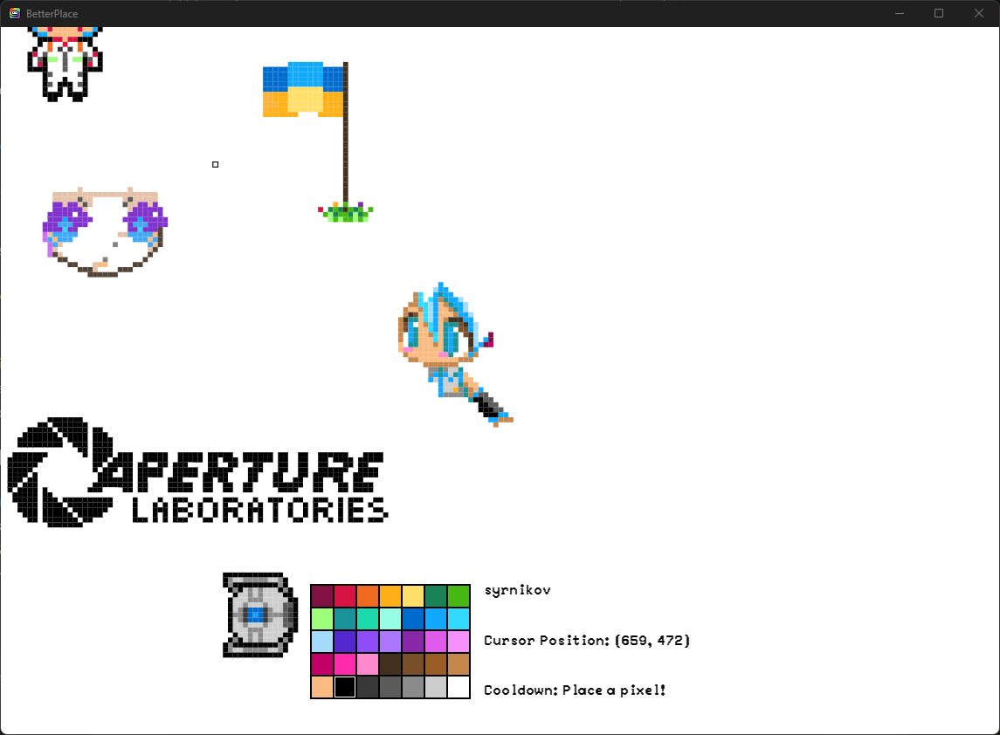

# Electron Pixel Art Collaborative Canvas Game

This is an Electron-based collaborative canvas game where users can create pixel art together in real-time. The project uses Firebase as the backend to store and synchronize the pixel data between users.

## Features

- Create pixel art collaboratively with other users in real-time.
- Zoom in and out of the canvas to work on finer details or see the big picture.
- Pan the canvas to navigate to different areas of the canvas.
- Set a cooldown timer between pixel placements to prevent spamming.

## Technologies Used

- Electron: A framework for building cross-platform desktop applications with web technologies.
- Firebase: A real-time database and backend-as-a-service provided by Google.
- HTML5 Canvas: Used for drawing and rendering the pixel art on the canvas.
- JavaScript: The main programming language used for the game logic.

## How to Use

1. [Open releases tab.](https://github.com/syrnikov/BetterPlace/releases)
2. Find latest release and download "dist.rar"
3. Unzip the file and run setup.exe
4. App should appear on your desktop.

## Usage

- Left-click on the canvas to place a pixel of the selected color. Note that there is a cooldown period between pixel placements to avoid spamming.
- Right-click to pan the canvas. You can also pan by clicking the middle mouse button.
- Use the scroll wheel to zoom in and out of the canvas.
- Select a color from the color palette to change the current drawing color.

## Color Palette

The color palette is located on the right side of the canvas. You can choose a color by clicking on the desired color swatch.

## How Data is Synchronized

The application uses Firebase as the backend to synchronize pixel data between different users. Whenever a user places a pixel, the pixel's coordinates and color are stored in the Firebase database. Other users' applications listen for changes in the database and update their canvas accordingly, ensuring real-time collaboration.

## Important Notes

- This project is still in development, and there might be bugs or performance issues.
- MacOs, Linux, Web versions and app autoupdate are coming soon.
- Please be respectful of others' work and avoid vandalizing or spamming the canvas.
- The application is designed for collaborative pixel art creation and may not be suitable for other types of drawings.

## Acknowledgments

This project is inspired by the collaborative canvas concept popularized by "r/place" on Reddit.

## License

This project is licensed under the [Creative Commons Attribution-NonCommercial-NoDerivatives 4.0 International License](LICENSE).

[License Details](https://creativecommons.org/licenses/by-nc-nd/4.0/)

## Contributing

Contributions to this project are welcome! If you find any issues or have suggestions for improvement, please feel free to submit a pull request.

## Contact

If you have any questions or feedback, you can contact the project owner at [syrnikov.school@gmail.com](mailto:syrnikov.school@gmail.com).

---
